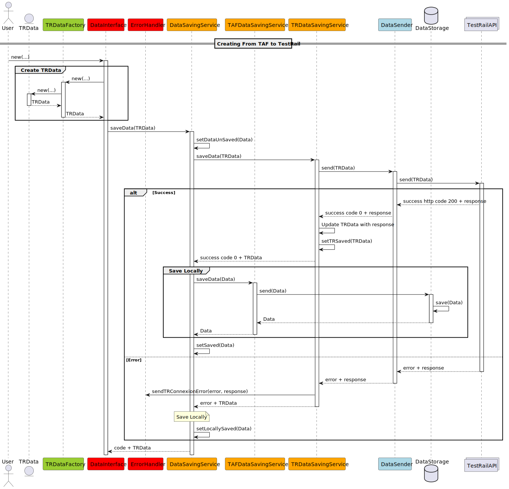

# TestRail module of TAF project

## Summary

This module is responsible for the integration of the TestRail tool with the TAF project.
It provides the possibility to exchange information with TestRail, a test management app.

It is build as a Spring Boot multi-module application with backend as the main module.

## Getting Started

### Prerequisites

- Java 17
- Spring Boot 2.6.6
- Maven

### Build the project

To build the project, run the following command:

```bash
mvn clean install
```

### Run the project

To run the project, run the following command:

```bash
mvn spring-boot:run -pl backend
```


## For developers

As we don't have access to a proper documentation system, we will use this README file to document the project.
Like this, we are sure that the next developers will have access to the information.

### Useful links

#### Multi-module Spring projects

- [Spring multi-module projects](https://spring.io/guides/gs/multi-module)
- [Getting Started | Creating a Multi Module Project](https://spring.io/guides/gs/multi-module)

---

---

### Project structure

---
#### Sub-module configuration

The submodule configuration is done in the [pom.xml](pom.xml) file and also inherited from the parent [TAF/pom.xml](../pom.xml) file.
The submodule is also declared in the main module configuration file [TAF/backend/pom.xml](../backend/pom.xml).

The spring-boot application configuration should only be defined once in the main module configuration file [application.yml](../backend/src/main/resources/application.yml).

---
#### Database

---

##### Database configuration

In order to facilitate the development process, we used a docker hosted MariaDB database.

A docker-compose file is available in the [docker-compose.yaml](./docker-compose.yaml) file.

To adapt the spring-boot application to the database, the configuration is done in the [application.yml](../backend/src/main/resources/application.yml) file. You may need to adapt "datasource", "jpa" and "sql" properties.
You may also need to add to the pom.xml file the dependency to the MariaDB driver (or whatever database you are using).

- pom.xml
```xml 
<dependency>  
	    <groupId>org.mariadb.jdbc</groupId>  
	    <artifactId>mariadb-java-client</artifactId>  
	    <version>3.4.1</version>  
</dependency>
```

- application.yml
```yaml

spring:
  datasource:
    url: jdbc:mariadb://localhost:3306/taf
    username: root
    password: root
  jpa:
    hibernate:
      ddl-auto: update
    properties:
      hibernate:
        dialect: org.hibernate.dialect.MariaDBDialect
  sql:
    init:
      platform: mariadb
```

- docker-compose.yaml
```yaml
  services:
      mariadb:
        image: mariadb:latest
        container_name: mariadb-taf
        environment:
          MYSQL_ROOT_PASSWORD: taf-root
          MYSQL_DATABASE: taf-db
          MYSQL_USER: taf
          MYSQL_PASSWORD: taf
        ports:
          - "3306:3306"
        networks:
          - taf-network
    
    
      networks:
        taf-network:
          driver: bridge
```

#### Database schema

The database schema dedicated to the TestRail module is automatically generated by Hibernate. The schema is generated in the database at the application startup.
The tables corresponding to the entities are created in the database.

#### Database for tests

For the tests, we use an in-memory H2 database which is automatically created and destroyed at the beginning and end of the tests.

To use it, you should create proper test files in the [src/test/java/ca.etsmtl.taf.testrail](./src/test/java/ca.etsmtl.taf.testrail) subdirectories. The next code shows an example of a test file:

```java
    import org.junit.jupiter.api.Test;
    import org.springframework.beans.factory.annotation.Autowired;
    import org.springframework.boot.test.autoconfigure.orm.jpa.DataJpaTest;
    import org.springframework.test.context.ContextConfiguration;
    
    @ContextConfiguration(classes = TestConfig.class)
    @DataJpaTest(properties = {
            "spring.jpa.hibernate.ddl-auto=create-drop",
            "spring.datasource.url=jdbc:h2:mem:testdb"
    })
    public class TestUnitTestRailProject {
        @Autowired
        private TestRailRepository testRailRepository;
    
        // Your tests here
        @Test
        public void test() {
            // Your test here
        }
    }
```

---

#### Module structure

---

This section describes the structure of the module.
##### controller
> Contains the controllers of the module. The controllers are the classes that handle the HTTP requests. They are the entry point of the module.

##### model
###### model/entity
>Contains the entities of the module.
>Each entity is a table in the database. Those class are meant to be used with the JPA repository. They only contain the fields of the table and the getters and setters.

>All the data that are saved locally but are meant to be sent or received from the TestRail API start with "TestRail" followed by the name of the entity. The corresponding tables are the tables that start with "tr_".

###### model/factory

>Contains the factories of the entities. Those factories are used to create entities. They can be used to create entities from JSON objects.

##### repository

>Contains the repositories of the module. The repositories are the interfaces that handle the database operations. They are used to save, update, delete and retrieve entities from the database.

##### service
###### service/data

>Contains the services that handle the data of the module. They are classes to interact with the TAF database and not the TestRail API.

###### service/manager

>Contains the services that handle the data gesture. 

service/manager/saving

>Those class are interfaces the user can interact with to save data. They handle the data saving between the database and the API.

service/manager/query

>Those class are interfaces the user can interact with to query data. They are used to send and receive data from the API and **not** the database.

---

#### How the module handle data saving between the database and the API

We consider that we have multiple constraints concerning the data. As we are never sure to be able to publish data to TestRail immediately, we need to save the data in the database and then publish it to TestRail.
But this can lead to duplication or loss of data. To avoid this, we have implemented a system that allows us to save the data in the database and then publish it to TestRail. That's why we decided to gesture that data like in the following diagram:

- Example when user wants to add a new data (not depending on the data type)


The module try to save the data remotely and then locally. If the remote saving fails, the local saving ensure that the data is saved and the user can continue to work. The data will be published to TestRail later.

---

#### Limitations

##### TestRail API

As we had a limited time we haven't covered all the TestRail data. We have only covered the data that we needed to start the module. But more types can be added easily when following the same classes structures.

We also haven't covered all the failure cases. We have only covered the more frequent and basic ones.

##### Failure cases and reports

Handling errors is something very important and this project doesn't report and save errors. Dedicated classes that can handle errors can be a good addition to the project and help a lot of debugging.

##### Data from TAF

As none of the other groups have yet a structure to save their data after testing, we had issue to use their data and to export them. That's why we focused more on TestRail API than that. Nevertheless, we started to develop interactions with gatling output. In order to do that, we simulated a potential structure for Gatling output data (entity).

---
#### Tests

We have done some tests especially for entity. 
Each entity have a dedicated test file that test each of the interactions with the entity.

We also have done some integration tests to validate data creation and deletion in the database and TestRail API through the managing classes.

---

#### Job to be done

We wrote "TODO" comments in the code to indicate missing parts or parts that need to be improved. We also wrote some comments to indicate what we have done and what we have not done.